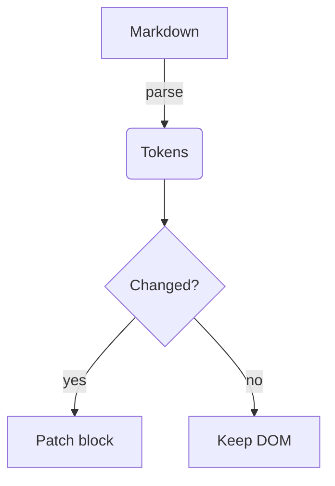

# GFM Torture Test

Every construct the preview must render. Open with **File → Open Markdown Preview…** and compare against the [markdown-preview spec](../../openspec/changes/rich-markdown-preview/specs/markdown-preview/spec.md).

## Contents check

The TOC sidebar should list every heading below, highlight the current one while scrolling, and smooth-scroll on click.

## Headings

# H1 — blue gradient
## H2 — violet
### H3 — soft red
#### H4 — cyan
##### H5 — green
###### H6 — muted caps

## Text

Plain paragraph with **bold**, *italic*, ***both***, ~~strikethrough~~, `inline code`, a [link](https://example.com), an auto-link https://example.com, and an emoji shortcode :rocket: :tada:.

Typographer test: "smart quotes" -- em dash... (c)

> A plain blockquote — elegant violet bar, not a callout.

> Note
> This is a **Note** callout: blue card, info icon. It has a [link](https://example.com) and `code`.

> Tip
> This is a **Tip** callout: green card.

> Warning
> This is a **Warning** callout: orange card.

> Danger
> This is a **Danger** callout: red card.

> [!NOTE]
> GitHub alert syntax also works.

> [!CAUTION]
> Caution maps to the danger style.

## Lists

1. Ordered one
2. Ordered two
   1. Nested ordered
   2. With another
      - Mixed nested bullet
      - Second bullet
3. Ordered three

- Bullet
- Bullet with long text that should wrap comfortably within the reading column and keep a pleasant line height while doing so
  - Nested
    - Deeply nested

### Task list

- [x] Render checked boxes as green checks
- [ ] Render unchecked boxes hollow
- [x] Keep them aligned

## Code

Inline: `const x = 42` in a sentence.

```typescript title=auth.ts
// Language badge "typescript", filename header "auth.ts", line numbers,
// copy button, wrap toggle. Click a line to highlight it.
export async function login(user: string, secret: string): Promise<Token> {
  const res = await fetch("/auth/login", {
    method: "POST",
    headers: { "Content-Type": "application/json" },
    body: JSON.stringify({ user, secret }),
  })
  if (!res.ok) throw new Error(`login failed: ${res.status}`)
  return res.json() as Promise<Token>
}
```

```python
def fib(n: int) -> int:
    """Fibonacci — python highlighting."""
    a, b = 0, 1
    for _ in range(n):
        a, b = b, a + b
    return a
```

```
plain fence — no language badge beyond "text", still numbered
with a very long line that should require horizontal scrolling unless the word-wrap toggle is on which is exactly what this sentence is for
```

```unknownlang
fenced with an unknown language — renders as plain text, no error
```

## Table

| Method | Path | Description | Notes |
| ------ | ---- | ----------- | ----- |
| GET | /users | List users | zebra row |
| POST | /users | Create a user | hover me |
| PUT | /users/:id | Replace a user | sticky header when tall |
| PATCH | /users/:id | Update fields | rounded corners |
| DELETE | /users/:id | Remove a user | soft shadow |

## Mermaid



```mermaid
this is not a valid diagram {{{
```

(The second diagram must show a friendly error + source, not break the page.)

## Math

Inline math $e^{i\pi} + 1 = 0$ flows with text.

$$
\int_0^\infty e^{-x^2}\,dx = \frac{\sqrt{\pi}}{2}
$$

## Images


## Footnotes

Here is a footnote reference[^1] and a second one[^long].

[^1]: The footnote text lives at the bottom with a back-link.
[^long]: Footnotes can hold longer text, `code`, and **formatting**.

## Horizontal rule

---

## HTML (off by default)

<div style="background: red; padding: 1em">Raw HTML block — hidden unless "Render raw HTML" is on in Settings; never executes scripts.</div>

<script>document.title = "XSS"</script>

## Links

- External: [example.com](https://example.com) → opens the default browser
- Anchor: [jump to Headings](#headings) → smooth-scrolls
- Relative: [another doc](./gfm-torture.md) → opens in the preview

*The end — ⌘F for "callout" should find 4+ matches with a count.*
